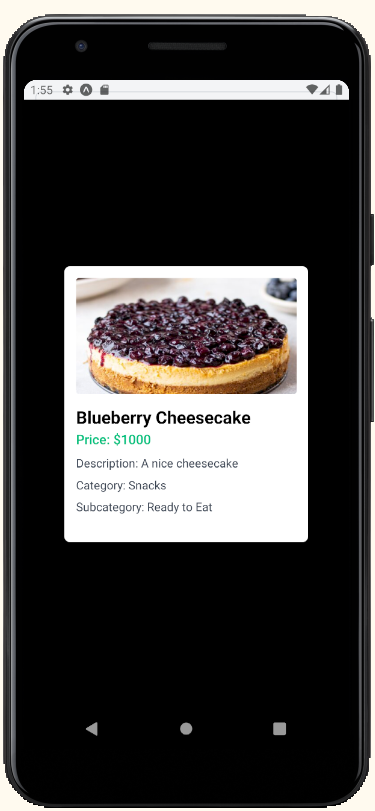
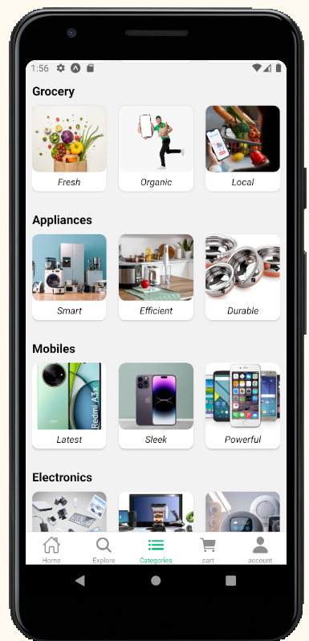

# Ecommerce Product App

## Overview

This is an Ecommerce Product App built using React Native with Expo and Tailwind CSS. The app allows users to browse products, view details in a pop-up modal, and navigate smoothly using tab navigation.

## Features

- Product Display using an API.
- Product search using an API.
- Banner carousel implemented with react-native-reanimated-carousel.
- Pop-up modal for viewing product descriptions.
- Custom icons for tab navigation with expo-router.
- Responsive and stylish UI using Tailwind CSS.

## Screenshots

Below are some screenshots of the website:

### Welcome Page


### Home Page


### Explore Tab


### Click to view the Product


### Categories Tab


### Cart Tab


### Account Tab


## Installation

 Clone the repository:
   ```bash
   git clone https://github.com/yourusername/Ecommerce_Product_App.git
